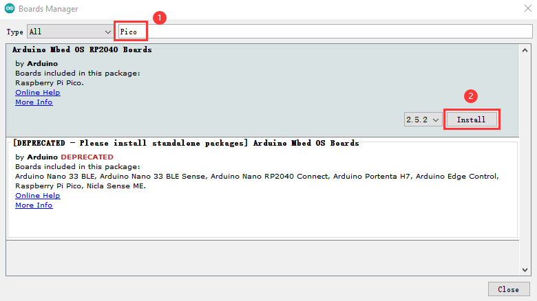
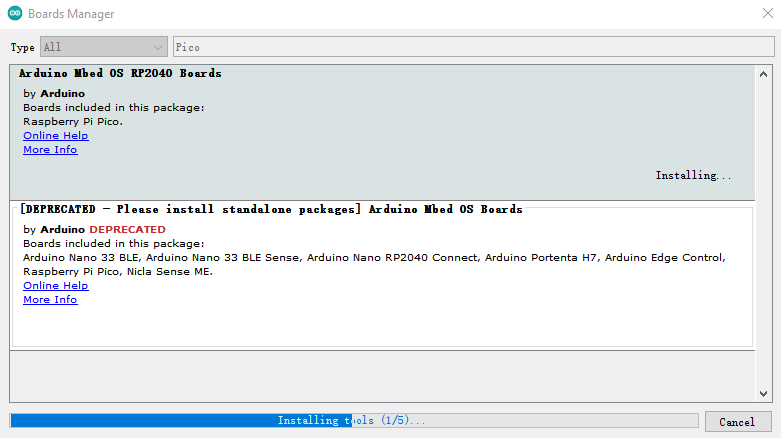
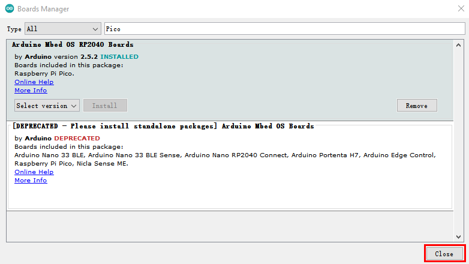
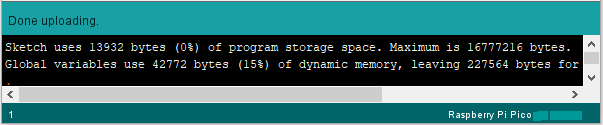

**Arduino软件安装，安装Pico开发板及上传Pico固件**

目录

[1.安装Windows驱动程序 1](#_Toc24593)

[1.1.下载安装arduino软件： 1](#_Toc31886)

[1.2.安装开发板Pico 7](#_Toc17836)

[1.3.上传Arduino兼容的Pico固件 9](#13上传arduino兼容的pico固件)

[2. 安装MAC驱动程序 13](#_Toc1978)

**1.安装Windows驱动程序**

## 1.1.下载安装arduino软件：

（1）首先，进入arduino官方网站：https://www.arduino.cc/ ，点击“SOFTWARE”进入下载页面，如下图所示：

（2）然后，根据你的操作系统选择并下载相应的安装程序。如果你是Windows用户，请选择“Windows安装程序”下载正确的安装驱动程序。

选择点击**Windows Win7 and newer**下载Arduino 1.8.16版本的安装程序，需要手动安装。而当点击**Windows ZIP file**时，Arduino 1.8.16版本的zip文件将被直接下载，只需要解压缩它就可以完成安装。

一般情况下，点击**JUST DOWNLOAD**就可以下载了，当然如果你愿意，你可以选择小小的赞助，以帮助伟大的Arduino开源事业。

（3）Arduino软件下载完成后，继续安装，当你收到**操作系统的警告时，请允许驱动程序安装**。首先点击**I Agree**, 然后选择好要安装的组件后再点击**Next**。

（4）选择安装目录(我们建议保持默认目录)，然后点击**Install**。

（5）如果出现以下界面，则应选择**Install**。

该过程将提取并安装所有必需的文件，以正确执行Arduino软件(IDE)。

安装完成后，会在桌面上生成一个Arduino 软件快捷方式。

A - 用于检查是否存在任何编译错误。

B - 用于将程序上传到Arduino控制板。

C - 用于创建新草图的快捷方式。

D - 用于直接打开示例草图之一。

E - 用于保存草图。

F - 用于从板接收串行数据并将串行数据发送到板的串行监视器。

## 1.2.安装开发板Pico

（1）网络连接良好的情况下，打开**Arduino IDE**，单击**Tools**→**Board**→**Boards Manager... 。**

1.  在搜索框中输入**Pico**，选择**Arduino Mbed OS RP2040 Boards**，点击**Install**。

（3）安装过程中，当你收到操作系统的安全警告时，请单击**Install**允许设备软件安装。

（4）安装完成后，单击**Close**就可以了。

## 1.3.上传Arduino兼容的Pico固件

如果你的Raspberry Pi Pico是新的，想使用Arduino学习和开发，则需要上传一个Adruino兼容的Pico固件。请参考以下步骤配置:

（1）断开Raspberry Pi Pico与电脑的连接。继续按Raspberry Pi Pico上的白色按钮(BOOTSEL)，并在松开按钮前将Raspberry Pi Pico连接到电脑。(注意：MicroUSB线连接到Raspberry Pi Pico前一定要一直按住按钮，否则固件下载不会成功)

（2）打开Arduino IDE，单击 **File**→**Examples**→**01.Basics**→**Blink**。

（3）单击**Tools**→**Board**→**Arduino Mbed OS RP2040 Boards**→**Raspberry Pi Pico**。

（4）上传草图（Blink）到 Raspberry Pi Pico。

当草图完成上传时，可以看到以下提示。

Raspberry Pi Pico上的指示灯开始闪烁。

 

单击**Tools**→**Port**→**COMx(Raspberry Pi Pico)**。COMx的X在不同的电脑上是不同的。请在你的电脑上选择正确的COM口。在这个的例子中，它是COM15。

**注意:**

1.  **第一次使用Arduino上传Raspberry Pi Pico的草图时，不需要选择端口。之后，每次上传草图前，请检查端口是否已选择;否则可能导致代码上传失败。**
2.  **有时在使用时，Raspberry Pi Pico可能会由于代码丢失固件而无法工作。此时，你可以如上所述步骤上传Raspberry Pi Pico的固件。**
1.  **安装MAC驱动程序**

## 2.1.下载安装Arduino IDE:

接下来的操作类似于Windows系统，可以参考上面的Windows系统操作过程。
