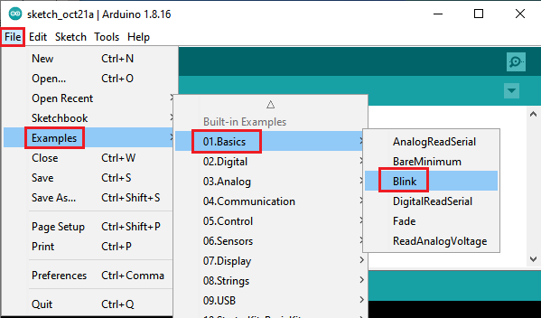
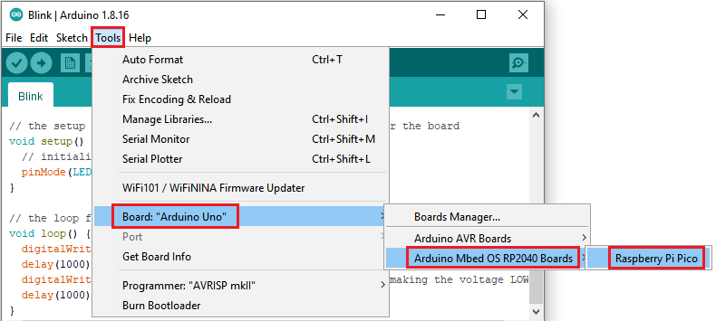
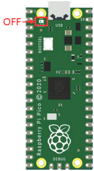

## Get started with Arduino

### Windows System

#### Installing Arduino IDE

When you get control board, you need to download Arduino IDE and driver firstly.

You could download Arduino IDE from the official website:

<https://www.arduino.cc/>, click the **SOFTWARE** on the browse bar, click“DOWNLOADS” to enter download page, as shown below:

There are various versions of IDE for Arduino. Just download a version compatible with your system. Here we will show you how to download and install the windows version of Arduino IDE.

There are two versions of IDE for WINDOWS system. You can choose between the installer (.exe) and the Zip file. For installer, it can be directly downloaded, without the need of installing it manually while for Zip package, you will need to install the driver manually.

You just need to click JUST DOWNLOAD.

After the Arduino is downloaded, click“I Agree”to continue installing

Click **Next**

Then click **Install.**

If the following page appears, click **Install.**

A- Used to verify whether there is any compiling mistakes or not.

B- Used to upload the sketch to your Arduino board.

C- Used to create shortcut window of a new sketch.

D- Used to directly open an example sketch.

E- Used to save the sketch.

F- Used to send the serial data received from board to the serial monitor.

#### Install the development board Pico

**Open Arduino IDE and click Tools**→**Board**→**Boards Manager...**

Search **Pico and select Arduino Mbed OS RP2040 Boards and click Install**

Click **Install**

Then click **Close**

#### Upload the pico compatible with Arduino

Disconnect the Raspberry Pi Pico with the computer, press and hold down the white button (BOOTSEL)，then connect the pico board to the computer.

Keep pressing the button before connecting the USB cable to the Pico board, otherwise the firmware can’t be uploaded.

Open Arduino IDE, click **File**→**Examples**→**01.Basics**→**Blink**

**Click Tools**→**Board**→**Arduino Mbed OS RP2040 Boards**→**Raspberry Pi Pico**

Upload the script Blink to the pico board

You can view this when uploading the sketch.

The indicator of the Raspberry Pi Pico starts flashing.

 

Click **Tools**→**Port**→**COMx(Raspberry Pi Pico)**

Select the correct COM port on the computer.

In the following picture, the port is COM 15.

Note

1.  When you upload a sketch of the Raspberry Pi Pico through Arduino, don’t select the port.

Check the port before uploading sketches.

1.  The Raspberry Pi Pico may not work due to code missing.

You can upload the Raspberry Pi Pico's firmware

### Mac System

Download Arduino IDE:

You can refer to the Windows system to operate.
