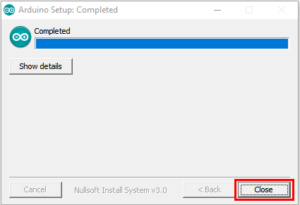
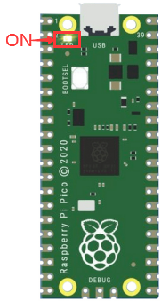

**How to Download Arduino, Drivers and Libraries**

**1. Install Windows Drivers**

## 1.1 Download and install Arduino software

Enter the Arduino official website: https://www.arduino.cc/ and click "SOFTWARE" to enter the download page, as shown in the following figure.

 Then, select and download the corresponding installer according to your operating system. If you are a Windows user, please select "Windows Installer" to download the correct installation driver.

Click **Windows Win7 and newer** to download the installer for Arduino 1.8.16, which needs to be installed manually. And when clicking on the **Windows ZIP file**, the zip file of the Arduino 1.8.16 will be downloaded directly, and you only need to unzip it to complete the installation.

Generally, you can download it by clicking **JUST DOWNLOAD**. Of course, if you like, you can choose a small sponsorship to help the great Arduino open source.

(3) Once the Arduino software is downloaded, continue to install. When you receive **a warning from your operating system, allow the driver to install.** Click on **I Agree**, select the components you want to install and then click **Next**.

1.  Select the installation directory (The default directory is recommended.), then click **Install**.

1.  If the following interface appears, you should select **Install**.

This process will extract and install all the necessary files to properly execute the Arduino software (IDE).

After the installation is complete, an Arduino software shortcut will be created on the desktop.

## 1.2.Install the Pico development board

**Open Arduino IDE**，and click **Tools**→**Board**→**Boards Manager...**

Enter Pico and select Arduino Mbed OS RP2040 Boards and click Install

Then click **Install**

Then click **Close**

## 1.3 Upload the pico firmware compatible with Arduino

You need to upload a pico firmware compatible with Arduino.

Disconnect the computer with the pico board.

Hold down the button BOOTSEL, connect them again before releasing the button.

Keep holding down the button before connecting the pico board with your computer; otherwise, the firmware can’t be downloaded

（2）Open Arduino IDE and **File**→**Examples**→**01.Basics**→**Blink**

Click **Tools**→**Board**→**Arduino Mbed OS RP2040 Boards**→**Raspberry Pi Pico**

Upload the script（Blink）to the Raspberry Pi Pico

Then the indicator on the Raspberry Pi Pico will flash.

 

Click **Tools**→**Port**→**COMx(Raspberry Pi Pico)**

Com port is different on the computers.

Please select your correct COM port. In this tutorial, the com port is Com15.

**Don’t select the port if it’s your first time to upload scripts to the pico board .**

**Select if the com port is correct when uploading the script each time; otherwise the code will fail to upload.**

**Sometimes, Raspberry Pi Pico can’t work in light of the loss of code. At this time, you need to upload the firmware of the pico board in accordance with above steps**

1.  **Install the driver on MAC**

Download Arduino IDE:

Just refer to the Windows system
